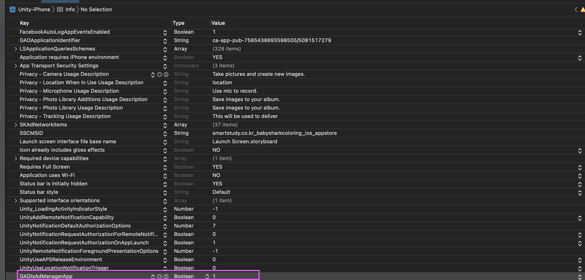

When you try build with google admob for iOS Build after install Google Admob unity plugin, if you met a build error with below message

and even after setup GADApplicationIdentifier ID value in plist

> "GADInvalidInitializationException: The Google Mobile Ads SDK was initialized without an application ID"

you have to setup GADIsAdManagerApp value

 Manually adding Plist values ​​to each Unity build is bad for productivity.

If you use the OnPostProcessBuild API provided by Unity, you can set a value in the Xcode project created at the end of the build in the Unity Editor.

public static void OnPostProcessBuild(BuildTarget target, string path)

 

E.g

private static void OnIOSBuild(BuildTarget target, string path)
{
    LocalizeName.AddLocalizedStringsIOS(path, Path.Combine(Application.dataPath, "testframework/localizationForiOS"));
    
    string infoPlistPath = path + "/Info.plist";

    PlistDocument plistDoc = new PlistDocument();
    plistDoc.ReadFromFile(infoPlistPath);
    if (plistDoc.root != null) {
        plistDoc.root.SetBoolean(ADMOB_SETTING, true);
        plistDoc.WriteToFile(infoPlistPath);
    }
    else {
        Debug.LogError("ERROR: Can't open " + infoPlistPath);
    }
}
 

You can see below sample

https://github.com/superbderrick/UnityiOSLocalization

