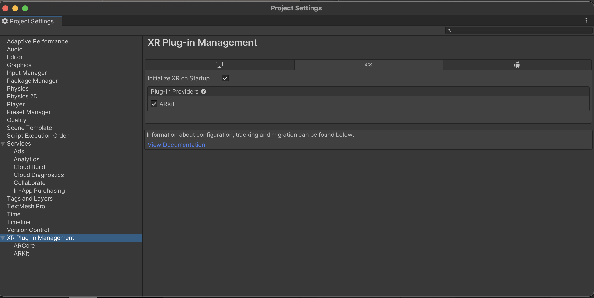

After basic setup for AR foundation from above official doc, It occured black screen with error message below

	No active UnityEngine.XR.ARSubsystems.XRSessionSubsystem is available. Please ensure that a valid loader configuration exists in the XR project settings

How to solve 

- Move Unity -> Edit -> Project settings 
- Do check plugin provider like below image  

from unity forum

https://forum.unity.com/threads/black-screen.885844/

	