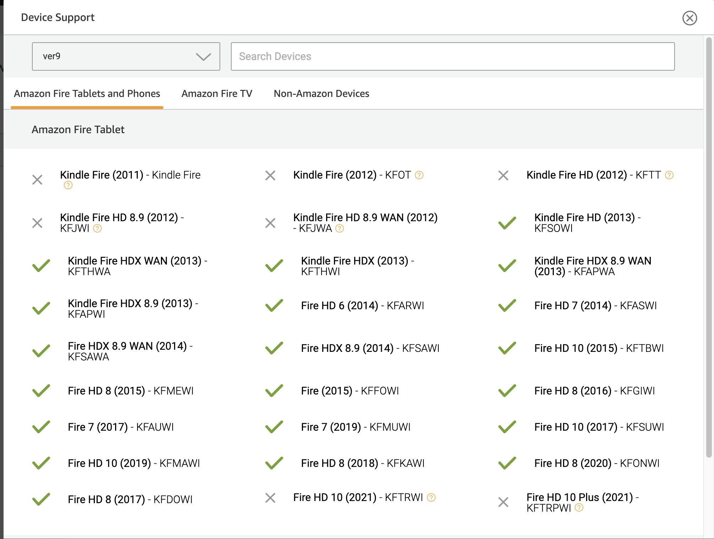
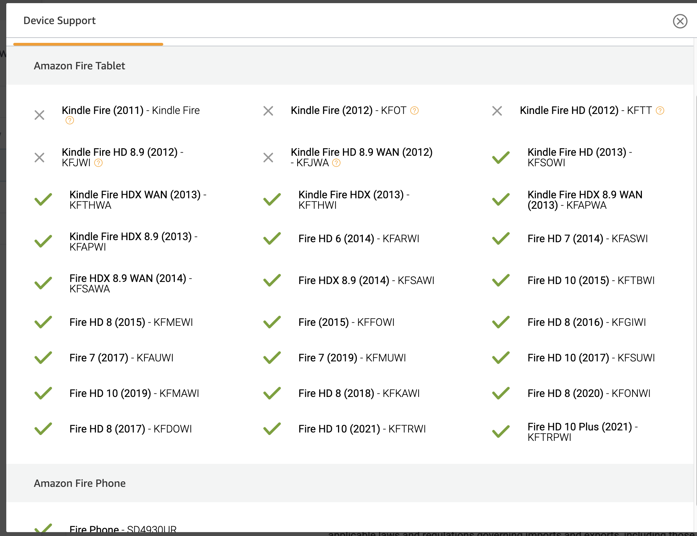

 

현재 근무 중인 회사에서 개발하고 있는 앱을 아마존 앱스토어에 출시하는 과정에 있습니다

개발을 완료하고 Amazon Development console에 최종적인 Android APK 파일을 업로드하였습니다

마켓에 앱을 출시하기에 개발한 게임이나 앱의 지원할 수 있는 Device Spec을 정할 수 있습니다

사진과 같이 Phone, Tablet 등 디바이스별로 정할 수 있는데, 이상하게도 아마존 최신 기기(Fire HD10) series 들은 X 표시가 되거나 -표시가 나는 거였습니다

I am working on new release app to amazon app store in company and after finished all features, I uploaded my apk file to amazon development console
In general, you can set the types of devices that an app can run on the Amazon App Store, As shown in the picture, you can set by device such as Phone, Tablet, etc

Strangely, Amazon's latest device (Fire HD10) series was marked with an X or a - mark

원인을 알아보니, 일차적으로 아마존 태블릿들은 32bit cpu환경의 기기들이 대부분이고 최신의 개발된 기기들은 64bit cpu환경을 지원했고, 이제 Apk에 포함될 라이브러리 구성들도 양쪽 Cpu type에 알맞게 구성이 되어야 했습니다

As I found out the cause, most of the Amazon tablets were devices with a 32-bit cpu environment, and the latest developed devices supported a 64-bit cpu environment. The library configuration to be included in the Apk also had to be configured appropriately for both CPU types
https://developer.amazon.com/docs/app-submission/understanding-submission.html

 
>>
	Best Practices for 64-bit APK submission
	Some Amazon devices (11th generation and above tablets) now accept hybrid 32 bit/64-bit APK submissions. This means to reach all Amazon devices, you should develop with 64-bit in mind. These two library folders must have the correct files:

	32-bit folder: lib/armeabi-v7a/
	64-bit folder: lib/arm64-v8a/
	For every library in one folder, there must be a corresponding library in the other folder. If you have a 32-bit library in the 32-bit folder, but do not have that same library in 64-bit format in your 64-bit folder, your application may crash or freeze on a device, or have In-app Purchasing (IAP) failures. 

 >>

 https://developer.amazon.com/docs/app-submission/understanding-submission.html

헛,,, 아마존에서 제시한 가이드인데 그럼에도 불구하고 계속적으로 -표시가 났습니다

Even though I followed the documentation, but it's still showing -

 

구글링 및 아마존 개발자 포럼에 글을 찾아보니 다음과 같은 정보를 얻을 수 있었어요

최신의 만든 기기들은 32/64 모든 cpu bit를 지원하는 기기여서 32bit cpu 라이브러 구성으로 맞추면 해당 기기들도 지원 가능하다고!!!

I googled and searched articles on Amazon developer forums and found the following information: The latest devices are devices that support all 32/64 cpu bits.
 

https://amazon.developer.forums.answerhub.com/questions/239488/in-app-purchasing-iap-v20-plugin-for-unity-arm64-v.html

 

64bit 타입의 라이브러리들을 지우 고나니 정상적으로 되었어요! 무 야호!
When I configure the libraries only in 32-bit, it works normally!
 

